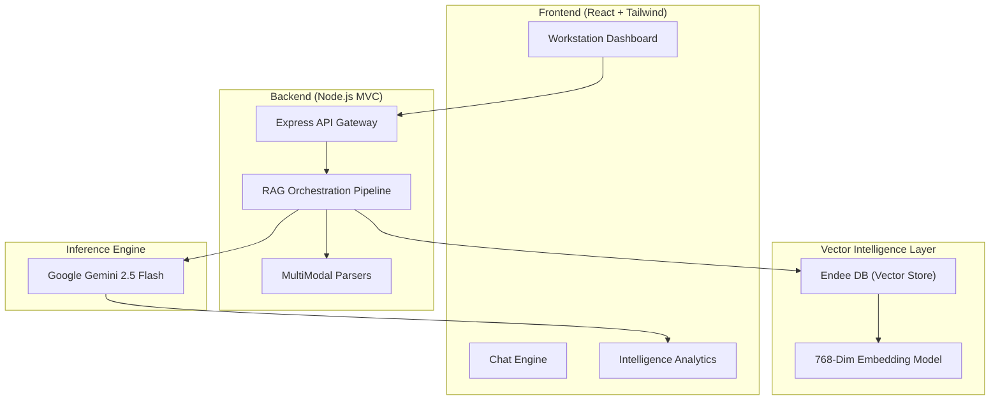

# MultiModal RAG Enterprise (MM-RAG-E) 🚀


A professional, high-fidelity **MultiModal Retrieval-Augmented Generation (RAG)** system built for the **Enterprise**. MM-RAG-E enables secure, private, and localized intelligence gathering from heterogeneous data sources including PDFs, Word documents, spreadsheets, presentations, images, and audio files.

---

## 🛠 System Design Architecture

MM-RAG-E follows a modern decoupled architecture designed for low-latency retrieval and high-reasoning synthesis.



### The RAG Pipeline
1.  **Ingestion**: Files (PDF, Image, Audio) are parsed and chunked.
2.  **Vectorization**: Chunks are converted into 768-dimensional embeddings.
3.  **Indexing**: Vectors are stored in **Endee DB** for ultra-fast semantic retrieval.
4.  **Retrieval**: Queries are vectorized and matched against Endee using **Cosine Similarity**.
5.  **Synthesis**: Best matches are fetched as context for **Google Gemini 2.5 Flash** to generate cited, hallucination-free answers.

---

## ⚡ Key Features

- **Intelligence Suite**: Real-time confidence scores and semantic relevance visualizers.
- **Unified Workspace Interface**: Streamlined document uploads integrated directly into the chat input bar for seamless multimodal interaction.
- **On-Demand Cancellation**: Halt large file uploads or ingestion processes instantly with integrated client-side cancellation.
- **Persistent Thread Management**: Switch between chat sessions instantly, complete with full message history recall and thread deletion.
- **Interactive Suggestions**: Clickable, context-aware follow-up suggestion chips generated dynamically in the message flow.
- **Multimodal Agnostic**: Native support for PDFs (`pdf-parse`), Word documents (`mammoth`), Spreadsheets & Presentations (`xlsx`, `officeparser`), Images (Gemini Vision), and Audio verbatim transcription.
- **Pro Diagnostics**: Real-time monitoring of search latency, generation speed, and local vector count.
- **Privacy-First**: Embedded local vector cache (`vectors.json`) ensuring sensitive vector indices remain within your infrastructure.

---

## 🏗 Endee: The Vector Backbone

MM-RAG-E leverages **Endee** as its primary high-performance vector database. Endee provides the speed and reliability required for real-time semantic search in a workstation environment.

### Integration Details:
- **Index Configuration**: Optimized for 768-dimensional embeddings (Gemini compatible).
- **Distance Metric**: **Cosine Similarity** for maximum semantic precision.
- **Use Case**: Endee handles the critical retrieval step of the RAG pipeline, filtering millions of potential data chunks down to the most relevant context in milliseconds.

---

## 🚀 Setup & Installation

### 1. Prerequisites
- **Node.js**: v18.0.0 or higher
- **Gemini API Key**: Obtain from [Google AI Studio](https://aistudio.google.com/)

### 2. Environment Configuration
Create a `.env` file in the root directory:
```env
PORT=5000
GEMINI_API_KEY=your_google_ai_studio_key
ENDEE_URL=http://localhost:8080/api/v1
ENDEE_INDEX_NAME=multimodal-rag-enterprise
UPLOAD_DIR=./data/uploads
```

### 3. Quick Start
```bash
# Install dependencies
npm install

# Start the full-stack system (Frontend + Backend)
npm run dev
```

### 4. Running the Frontend/Backend Separately
```bash
# Backend Only
cd Backend && npm start

# Frontend Only
cd Frontend && npm run dev
```

---

## 📂 Repository Structure

```
MM-RAG-E/
├── Frontend/           # React Dashboard & Workspace
├── Backend/            # Express.js API & MVC Logic
├── ai-services/        # RAG Pipeline, Embeddings, & Parsers
├── data/               # Local Vector Cache & Temp Uploads
├── docs/               # System Documentation
└── package.json        # Project Orchestration
```

---

## 🤝 Contributing

We welcome contributions to MM-RAG-E! Please follow these steps:

1. Fork the repository
2. Create a feature branch (`git checkout -b feature/amazing-feature`)
3. Commit your changes (`git commit -m 'Add some amazing feature'`)
4. Push to the branch (`git push origin feature/amazing-feature`)
5. Open a Pull Request

### Development Guidelines
- Follow the existing code style
- Add tests for new features
- Update documentation as needed
- Ensure all tests pass before submitting

---

## 📄 License
This project is licensed under the MIT License - see the [LICENSE](LICENSE) file for details.

*Built for the Endee Candidate Submission Challenge.*
